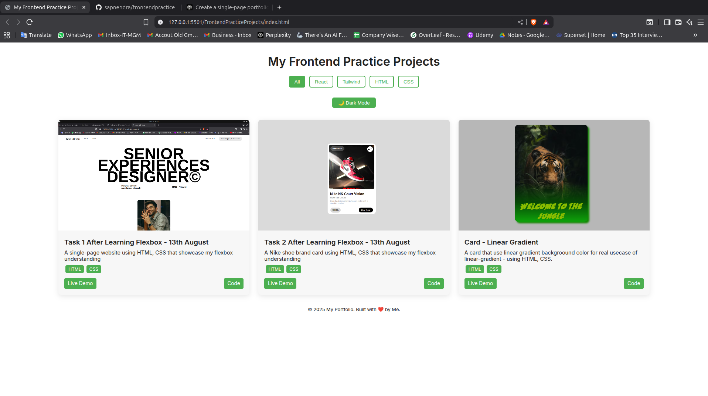
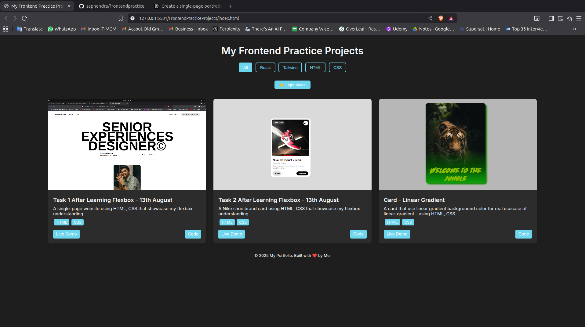

# 📌 Frontend Projects Practice

A **single-page website** built with **HTML, CSS, and JavaScript** to showcase my **daily frontend practice projects** with filtering, responsive design, and light/dark mode.  
Projects are dynamically loaded from a local `projects.json` file.

---

## 🚀 Features

- **Dynamic Projects** — Loads projects from `projects.json` (easy to update without touching HTML).
- **Tech Stack Filters** — View projects built with HTML, CSS, or all.
- **Responsive Grid Layout** — Mobile-first design that works on all devices.
- **Dark/Light Mode Toggle** — Switch themes with one click.
- **Local Storage Support** — Remembers your last selected filter across sessions.
- **Hover Effects & Transitions** — Modern UI/UX interactions.

---

## 📂 Project Structure

portfolio/
│
├── index.html # Main landing page
├── style.css # Styles (modern, responsive, mobile-first)
├── script.js # JS for fetching data, filtering, theme toggle
├── projects.json # Project data file
└── images/
    ├── project1.jpg
    ├── project2.jpg
    └── project3.jpg

---

## 🛠️ How to Run Locally

1️⃣ **Clone this repository**
git clone https://github.com/sapnendra/frontendpractice
cd frontendpractice

2️⃣ **Open in a local server** (because `fetch` on JSON requires one)
- **Using VS Code**: Install the [Live Server extension](https://marketplace.visualstudio.com/items?itemName=ritwickdey.LiveServer), then right-click `index.html` → **Open with Live Server**.

3️⃣ **Explore and Customize** 🎨

## 📄 Customization

- **Add New Projects** → Open `projects.json` and append a new object:

{
"title": "New Project Name",
"description": "Short description here.",
"techStack": ["HTML", "CSS"],
"image": "images/new-project.jpg",
"demoLink": "https://example.com/demo",
"codeLink": "https://github.com/username/repo"
}

- **Change Images** → Add them inside `/images` and update the `image` path in JSON.
- **Change Colors** → Update CSS variables in `style.css` under `:root` and `.dark`.

---

## 📸 Screenshots

Light Mode:

Dark Mode:

---

## 📌 Tech Stack

- **HTML5**
- **CSS3** (custom, no frameworks)
- **Vanilla JavaScript**
- **Google Fonts (Inter)**

---

## 📜 License
This project is licensed under the MIT License — feel free to use and modify it.

---

💙 *Built with love to practice and showcase frontend projects.*
